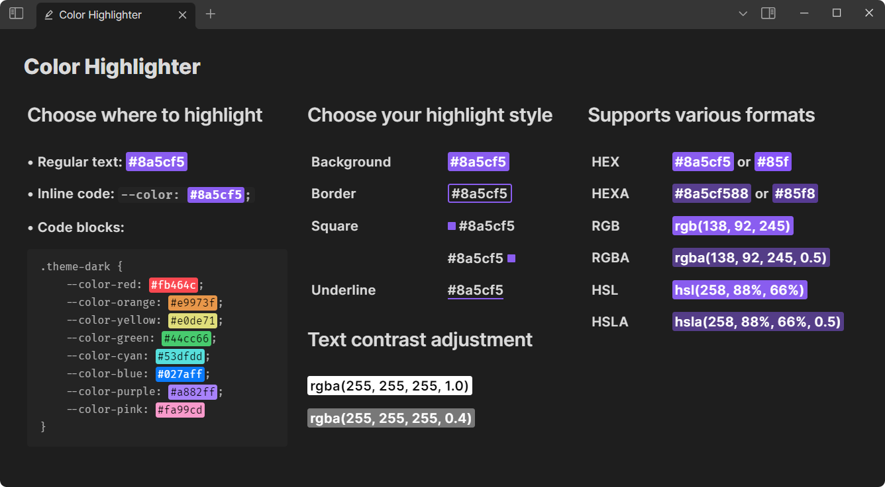
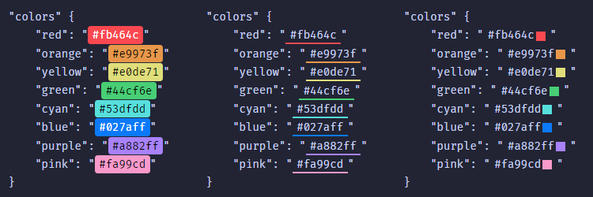

# Color Highlighter

## Overview

Color Highlighter is a plugin for Obsidian that enhances your note-taking experience by automatically highlighting color codes in your notes. It provides visual representation of colors directly in your text, making it easier to work with color-related information. Customizable options allow you to control where your highlights happen and how they look.

> [!NOTE]
> This plugin is currently in beta. Please report any issues or feedback to help improve it!

## Features

- Highlights color codes in various formats (HEX, RGB, RGBA, HSL, HSLA)
- Customize where to highlight
  - Highlight everywhere, highlight only in inline code (single backticks), highlight only in codeblocks (triple backticks)
- Customize how to highlight
  - Highlight with background color, underline, or preview square
- Works in Source Mode, Reading Mode, and Live Preview
- Automatically adjusts text color for optimal contrast with the highlighted background

## Installation

### Installing manually

As this plugin is currently in beta, it's not available in the Obsidian Community Plugins browser. To install:

1. Download the latest release from this GitHub repository.
2. Create a new directory inside your Obsidian vault's plugin directory at `.obsidian/plugins/color-highlighter`.
3. Move the downloaded files into the new directory.
4. Reload Obsidian.
5. Go to 'Settings' > 'Community plugins' and enable Color Highlighter.

### Installing using BRAT

BRAT (Beta Reviewers Auto-update Tool) is a community plugin that makes it easier to review and test new plugins and themes that are still in beta. Updates are downloaded automatically without the need for the user to manually create new directories or change any files. To install using BRAT:

1. Make sure you have installed and enabled the BRAT plugin from the Obsidian Community Plugins browser.
3. Copy this link: `https://github.com/heatherpiper/color-highlighter`
4. Open the command palette and run the command `BRAT: Add a beta plugin for testing`.
5. Paste the link into the pop-up modal and select 'Add Plugin'.
6. After BRAT confirms the installation, go to 'Settings' > 'Community plugins' and enable Color Highlighter. You made need to first refresh the list of plugins.

## Usage

Once installed and enabled, the plugin will automatically highlight color codes based on your settings. To configure the plugin:

1. Go to 'Settings' > 'Community plugins'.
2. Find Color Highlighter in the list and click on the gear icon to access its settings.
3. Choose your preferred highlighting option:
   - Highlight everywhere: Highlights all color codes in your notes.
   - Highlight in inline code: Only highlights color codes within single backticks.
   - Highlight in codeblocks: Only highlights color codes within triple backticks (codeblocks).
4. Choose your preferred highlighting style:
   - Background: Highlights color codes by changing their background color
   - Underline: Highlights color codes by adding a solid color underline
   - Colored Square: Highlights color codes by adding a small preview square following the color code

**Note:** After changing any settings, you may need to reload any open notes to see the changes take effect.

## Feedback and Contributions

As this plugin is in beta, your feedback is crucial! If you encounter any issues or have suggestions for improvements:

1. Check the [GitHub Issues](https://github.com/heatherpiper/color-highlighter/issues) to see if it has already been reported.
2. If not, please open a new issue with as much detail as possible.

Contributions are welcome! Feel free to fork the repository and submit pull requests.

## License

[MIT License](LICENSE)
