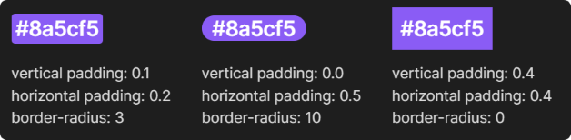
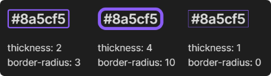
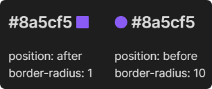
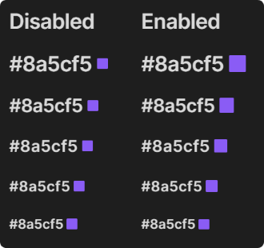
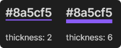
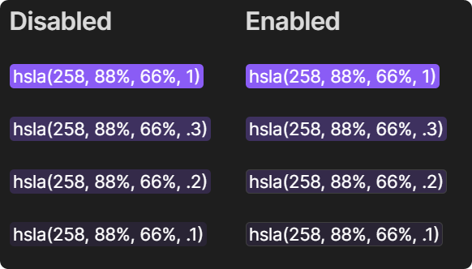
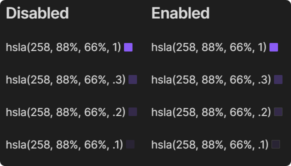

# Color Highlighter

## Overview

Automatically detect and highlight color codes in your notes.


Color Highlighter provides a visual representation of colors directly in your text, making it easier to work with color-related information. Customizable options allow you to control where and how your highlights appear.

> [!NOTE]
> This plugin is currently in beta. Please report any issues or leave feedback to help improve it.

## Features

- Automatically detects and highlights color codes in various formats
    - HEX
        - #rgb
        - #rgba
        - #rrggbb
        - #rrggbbaa 
    - RGB and RBGA
    - HSL and HSLA
- Customize where colors are highlighted:
    - Anywhere
    - Within inline code (single backticks)
    - Within code blocks (triple backticks)
- Customize highlighting style:
    - Background color
    - Border
    - Square
    - Underline
- Works in Source Mode, Reading Mode, and Live Preview
- Automatically adjusts text color for optimal contrast with highlighted background
- Optionally shows a color picker tool when hovering over highlighted color codes

## Installation

### Install manually

As this plugin is currently in beta, it's not yet available in the Obsidian community plugins directory. 

To install:

1. Download the [latest release](https://github.com/heatherpiper/color-highlighter/releases) files (`main.js`, `manifest.json`, and `styles.css`).
2. Create a new folder inside your Obsidian vault's plugin directory at `.obsidian/plugins/color-highlighter`.
3. Move the downloaded files into the new directory.
4. Reload Obsidian.
5. Go to **Settings → Community plugins** and enable Color Highlighter.

### Install using BRAT

BRAT (Beta Reviewers Auto-update Tool) is a community plugin that makes it easier to review and test new plugins and themes that are still in beta. Updates are downloaded automatically without the need for the user to manually change any files. 

To install using BRAT:

1. Make sure you have installed and enabled the BRAT plugin from the Obsidian community plugins directory.
2. Copy this link: `https://github.com/heatherpiper/color-highlighter`
3. Open the command palette and select the command **BRAT: Add a beta plugin for testing**.
4. Paste the link into the pop-up modal and select **Add Plugin**.
5. After BRAT confirms the installation, go to **Settings → Community plugins** and enable Color Highlighter. You made need to first refresh the list of plugins.

## Usage and settings

Once installed and enabled, the plugin will automatically detect and highlight color codes based on your settings. To configure the plugin, go to **Settings → Community plugins**. Find Color Highlighter in the list and select the gear icon to access its settings.

### Highlight locations

Choose what part of your notes to highlight color codes in:

   - **Highlight anywhere**: Highlight all color codes anywhere in your notes.
   - **Highlight only in code**:
       - **Highlight in inline code**: Only highlight color codes within single backticks.
       - **Highlight in code blocks**: Only highlight color codes within triple backticks.

### Highlight style

   - **Background**: Changes the background color of color codes.
   - **Border**: Adds a solid color border around color codes.
   - **Square**: Adds a small colored square before or after color codes.
   - **Underline**: Adds a solid color underline to color codes.


#### Customizing the highlight style

You can further refine the appearance of highlights with style-specific adjustments.

**Background adjustments**: 
- vertical padding
- horizontal padding
- border radius



**Border adjustments**:
- thickness
- border radius



**Square adjustments**: 
- position (before or after text)
- border radius



- size: choose whether to scale the size of the square with the size of the text (if disabled, the square will always be a fixed 10 x 10 pixels.)



**Underline adjustments**: 
- thickness



### Overriding the default highlight style

You can override the default highlight style on a per-note basis using a note's frontmatter (properties). Add `highlightStyle` as a new property to a note's frontmatter and indicate which style you want to use for that note. The available options are `background`, `border`, `square`, or `underline`. 

Example: 

    ```
    ---
    highlightStyle: underline
    ---
    ```

If no valid `highlightStyle` property is found, the default style indicated in the settings will be used. 

You can also easily set a note's highlight style by selecting the command **Color Highlighter: Set highlight style for this note** from the command palette and then choosing your preferred highlight style from the drop-down menu.


### Contrast border

If your highlight style is set to **background** or **square**, you can choose to enable a contrasting border that appears around low-contrast highlights. This adds a faint border around highlights if there is not sufficient contrast between the highlight color and the editor's background color.





### Color picker

By default, a color picker is displayed when hovering over highlighted color codes. You may choose to disable this behavior. 

If this setting is disabled, the color picker can still be displayed by selecting the command **Color Highlighter: Show color picker** in the command palette. Your cursor must be on a highlighted color for this command to be available.

## Feedback and Contributions

As this plugin is in beta, your feedback is crucial! If you encounter any issues or have suggestions for improvements:

1. Check the [GitHub issues](https://github.com/heatherpiper/color-highlighter/issues) to see if it has already been reported.
2. If not, please open a new issue with as much detail as possible. Suggestions for new features are welcome!

Contributions are welcome! Feel free to fork the repository and submit pull requests.

## License

[MIT License](LICENSE)
